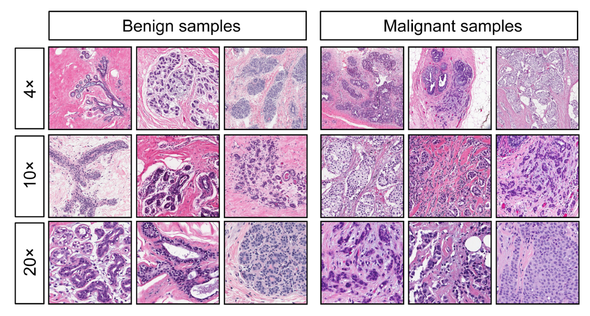

### Machine learning Web Application to detect Breast Cancer

Multiple predictive Machine Learning models are
trained on Breast Cancer data for potentially
ascertaining between malignant and benign tumor.

### Dataset



This dataset is taken from
[Kaggle](https://www.kaggle.com/uciml/breast-cancer-wisconsin-data).

Features are computed from a digitized image of a fine needle aspirate (FNA) of
a breast mass. They describe characteristics of the cell nuclei present in the
image.

Also can be found on [UCI Machine Learning
Repository](https://archive.ics.uci.edu/ml/datasets/Breast+Cancer+Wisconsin+%28Diagnostic%29).

#### Attribute Information

1. ID number
2. Diagnosis (M = malignant, B = benign)
   3-32)

Ten real-valued features are computed for each cell nucleus:

1. radius (mean of distances from center to points on the perimeter)
2. texture (standard deviation of gray-scale values)
3. perimeter
4. area
5. smoothness (local variation in radius lengths)
6. compactness (perimeter^2 / area - 1.0)
7. concavity (severity of concave portions of the contour)
8. concave points (number of concave portions of the contour)
9. symmetry
10. fractal dimension ("coastline approximation" - 1)

The mean, standard error and "worst" or largest (mean of the three
largest values) of these features were computed for each image,
resulting in 30 features. For instance, field 3 is Mean Radius, field
13 is Radius SE, field 23 is Worst Radius.

All feature values are recoded with four significant digits.
lissing attribute values: none
Class distribution: 357 benign, 212 malignant

### Features

```json
{
  "features": [
    "radius_mean",
    "texture_mean",
    "perimeter_mean",
    "area_mean",
    "smoothness_mean",
    "compactness_mean",
    "concavity_mean",
    "radius_worst",
    "texture_worst",
    "perimeter_worst",
    "area_worst",
    "smoothness_worst",
    "compactness_worst",
    "concavity_worst",
    "concave points_worst",
    "symmetry_worst",
    "fractal_dimension_worst"
  ]
}
```

### Models

- Logistic Regressor
- Support Vector Classifier
- Random Forest Classifier
- Decision Tree Classifier
