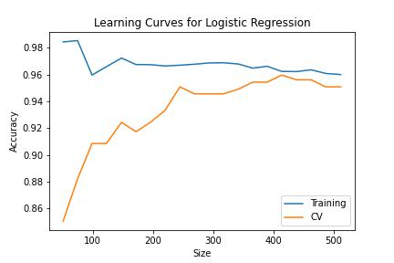

## Machine learning Web Application to detect Breast Cancer

Multiple predictive Machine Learning models are
trained on Breast Cancer data for potentially
ascertaining between malignant and benign tumor.

### [Dataset](https://www.kaggle.com/uciml/breast-cancer-wisconsin-data)

<p align="center"></img></p>

Features are computed from a digitized image of a fine needle aspirate (FNA) of
a breast mass. They describe characteristics of the cell nuclei present in the
image.
Also can be found on [UCI Machine Learning
Repository](https://archive.ics.uci.edu/ml/datasets/Breast+Cancer+Wisconsin+%28Diagnostic%29).

#### Attribute Information

1. ID number
2. Diagnosis (M = malignant, B = benign)
   3-32)

Ten real-valued features are computed for each cell nucleus:

1. radius (mean of distances from center to points on the perimeter)
2. texture (standard deviation of gray-scale values)
3. perimeter
4. area
5. smoothness (local variation in radius lengths)
6. compactness (perimeter^2 / area - 1.0)
7. concavity (severity of concave portions of the contour)
8. concave points (number of concave portions of the contour)
9. symmetry
10. fractal dimension ("coastline approximation" - 1)

The mean, standard error and "worst" or largest (mean of the three
largest values) of these features were computed for each image,
resulting in 30 features. For instance, field 3 is Mean Radius, field
13 is Radius SE, field 23 is Worst Radius.

All feature values are recoded with four significant digits.
lissing attribute values: none
Class distribution: 357 benign, 212 malignant

### Features

```json
{
  "features": [
    "radius_mean",
    "texture_mean",
    "perimeter_mean",
    "area_mean",
    "smoothness_mean",
    "compactness_mean",
    "concavity_mean",
    "radius_worst",
    "texture_worst",
    "perimeter_worst",
    "area_worst",
    "smoothness_worst",
    "compactness_worst",
    "concavity_worst",
    "concave points_worst",
    "symmetry_worst",
    "fractal_dimension_worst"
  ]
}
```

- Minimum and Maximum values of each feature

  | Feature                | Min Value  | Max Value   |
  | ---------------------- | ---------- | ----------- |
  | radius_mean            | 6.981000   | 28.110000   |
  | ractal_dimension_worst | 9.710000   | 39.280000   |
  | ymmetry_worst          | 43.790000  | 188.500000  |
  | oncave_points_worst    | 143.500000 | 2501.000000 |
  | oncavity_worst         | 0.052630   | 0.163400    |
  | ompactness_worst       | 0.019380   | 0.345400    |
  | moothness_worst        | 0.000000   | 0.426800    |
  | rea_worst              | 7.930000   | 36.040000   |
  | erimeter_worst         | 12.020000  | 49.540000   |
  | exture_worst           | 50.410000  | 251.200000  |
  | adius_worst            | 185.200000 | 4254.000000 |
  | oncavity_mean          | 0.071170   | 0.222600    |
  | ompactness_mean        | 0.027290   | 1.058000    |
  | moothness_mean         | 0.000000   | 1.252000    |
  | rea_mean               | 0.000000   | 0.291000    |
  | erimeter_mean          | 0.156500   | 0.663800    |
  | texture_mean           | 0.055040   | 0.207500    |

### Models

- Logistic Regressor
- Support Vector Classifier
- Random Forest Classifier
- Decision Tree Classifier

#### Training

Below are the learning curves of models which did not undergo hyperparameter
optimization.

| Model                     | Learning Curves                                       |
| ------------------------- | ----------------------------------------------------- |
| Logistic Regressor        |  |
| Support Vector Classifier |           |
| Random Forest Classifier  |            |
| Decision Tree Clasifier   |            |

#### Hyperparameter Optimization

Using `sklearn.model_selection.RandomizedSearchCV` and
`sklearn.model_selection.GridSearchCV` the parameter space for each model has
been searched with parallel computing(`n_jobs=-1`).

```json
{
  "logistic_regression_params": {
    "random_state": 0,
    "solver": "liblinear",
    "tol": 0.0001
  },
  "svc_params": {
    "C": 10,
    "gamma": 0.0001,
    "kernel": "rbf"
  },
  "random_forest_classifier_params": {
    "max_depth": 80,
    "min_sample_leaf": 4,
    "min_sample_split": 5,
    "n_estimator": 600
  },
  "decision_tree_params": {
    "criterion": "entropy",
    "max_depth": 3,
    "min_samples_leaf": 10
  }
}
```

| Model                     | Learning Curves                                        |
| ------------------------- | ------------------------------------------------------ |
| Logistic Regressor        |        |
| Support Vector Classifier |                        |
| Random Forest Classifier  |  |
| Decision Tree Classifier  |   |

### Deployment


#### Requirements

```
numpy==1.21.4
pandas==1.3.4
scikit_learn==1.0.1
streamlit==1.3.0
```
